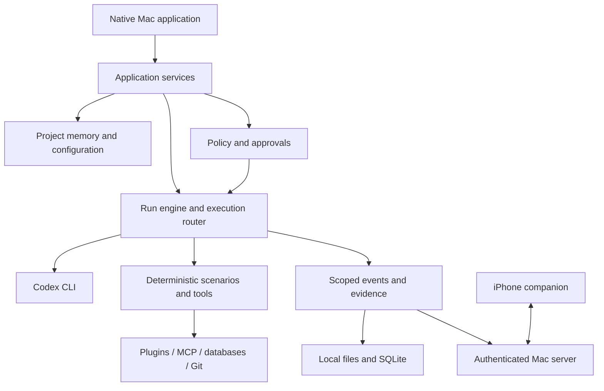

# Product and system overview

Status: design specification; product implementation is pending. The current Xcode repository contains the default multiplatform scaffold. This document is not a claim that the features below work.

<!-- Source sections: 1,2,3,5,20,99,108,109,110,114,158 -->
Source: [final architecture](final-architecture.txt), sections 1–5, 20, 99, 108–110, 114, and 158.

AgentDesk is a local engineering context and execution platform for QA, automation, coding, debugging, documentation, project knowledge, and technical investigation. The native Mac application owns execution and authority. The iPhone companion provides secure observation, review, approvals, and limited predefined controls over the local network.

## Ownership and boundaries

| Component | Responsibility |
| --- | --- |
| AgentDesk | Workspaces, projects, instructions, agents, skills, memory, workflows, policy, permissions, approvals, execution state, integrations, storage, evidence, telemetry, devices |
| Codex CLI | Reasoning, semantic interpretation, code analysis/modification, test design, debugging, documentation generation |
| Deterministic tools | Known scenario execution, parsing, comparisons, validation, test commands, exit handling, Git collection, SQL classification |
| Mac runtime | All engineering operations and access to company infrastructure |
| iPhone | Authorized views and constrained commands sent to the Mac |

The model does not own security decisions. A prompt cannot grant filesystem, database, plugin, MCP, repository, or device access. Every boundary must enforce workspace/project context in ordinary code.

## Non-negotiable choices

Use Swift, SwiftUI, native macOS/iOS targets, Swift Package Manager, modern Swift concurrency, local filesystem, SQLite, macOS Keychain, Codex CLI, and MCP. Do not introduce React, Electron, Tauri, OpenAI API, `OPENAI_API_KEY`, Agents SDK, unofficial ChatGPT authentication, extracted cookies, or mandatory cloud infrastructure.

Mac↔iPhone LAN communication must work without internet, VPN, or a cloud service. Codex and external integrations can independently require internet. Optional private VPN or relay support must not become a prerequisite for local operation.

## Delivery sequence

| Phase | Outcome |
| --- | --- |
| 1 | Native Mac foundation: workspace/project/agent creation through a real Codex run, live steps, results and files |
| 2 | Versioned project memory, current requirements, test traceability, persistent bugs and duplicate handling |
| 3 | Scoped plugin, Jira, MCP and database connection lifecycle and permissions |
| 4 | Mixed deterministic/agent workflows, branching, retries, teams and QA investigation |
| 5 | Secure native iPhone companion, Bonjour pairing, live LAN progress, review and constrained control |
| 6 | Advanced evals, AgentDesk MCP server, richer analytics, editor, history, scheduling and optional connectivity |

The [task plan](../Development/tasks.md) provides initial commit boundaries. Added requirements in sections 115–159 remain part of the product; completing Phase 1 does not complete them. An initial iPhone shell must clearly show its unpaired state until actual remote functionality exists.

## Acceptance

Phase 1 must demonstrate creation of a workspace, project, and agent; instruction editing; a supported authenticated Codex execution; live steps; and inspection of results and changed files. Test failures, missing credentials and unavailable provider metadata must be visible rather than replaced by invented results.

The final QA scenario follows requirement v4, investigates a failure with repository/API/database evidence, finds the existing B2C-1234 defect, and prepares additional evidence without creating a duplicate issue. A paired iPhone on the same Wi-Fi receives live progress, reviews the exact proposed comment, and authorizes the Mac to execute it. The run, evidence, requirement links, bug history and local usage remain available afterward. Section 114 retains the complete acceptance sequence.

## Documentation boundaries

Every subsystem page records responsibilities, data/authority boundaries, failure behavior, and verification expectations. Additional implementation proposals are labeled as proposals. Concrete APIs, storage schemas, deployment targets, supported CLI flags and release claims must be updated from actual implementation and test evidence.
